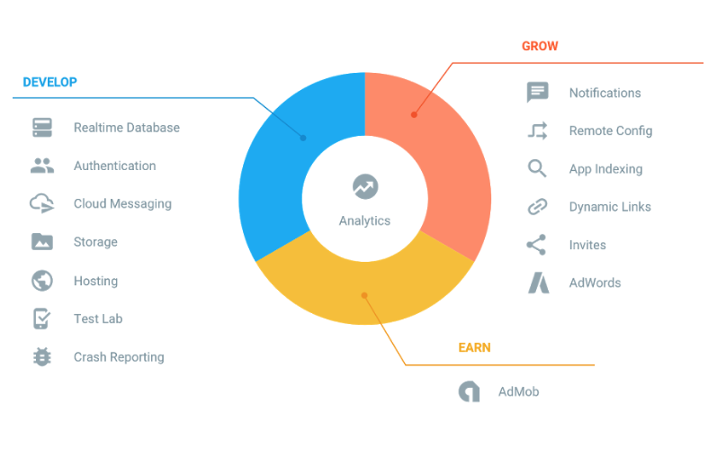
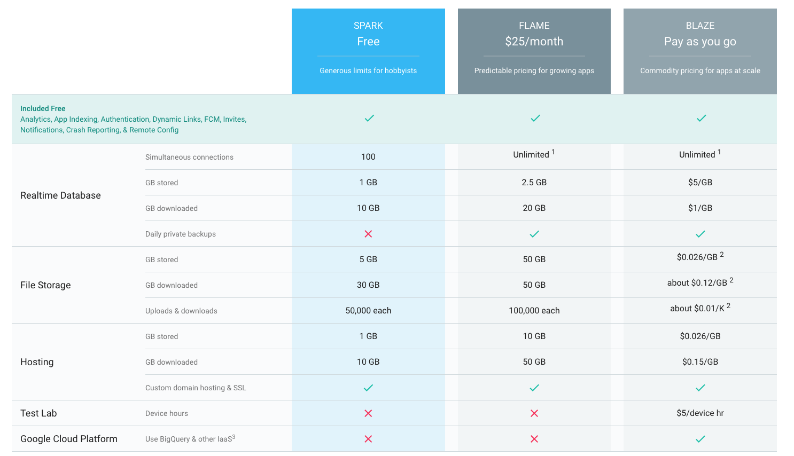
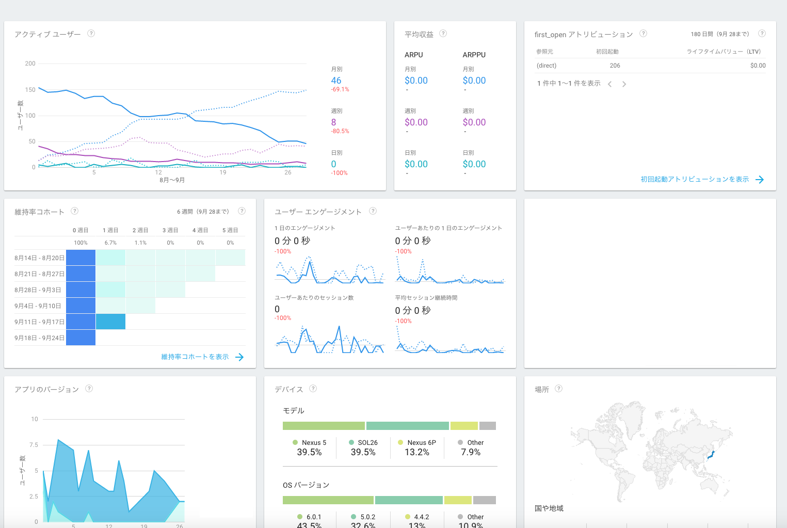
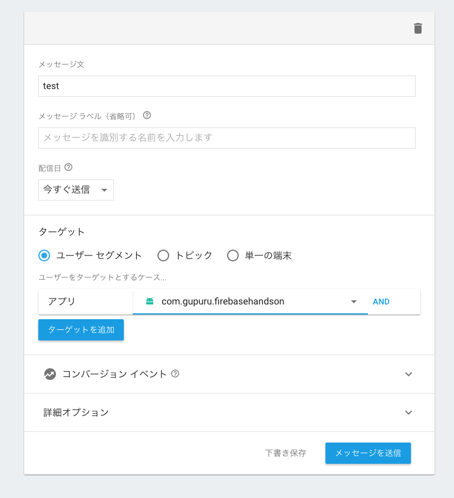
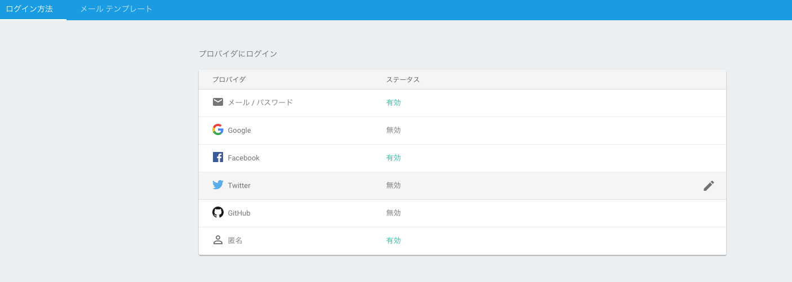
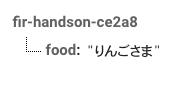
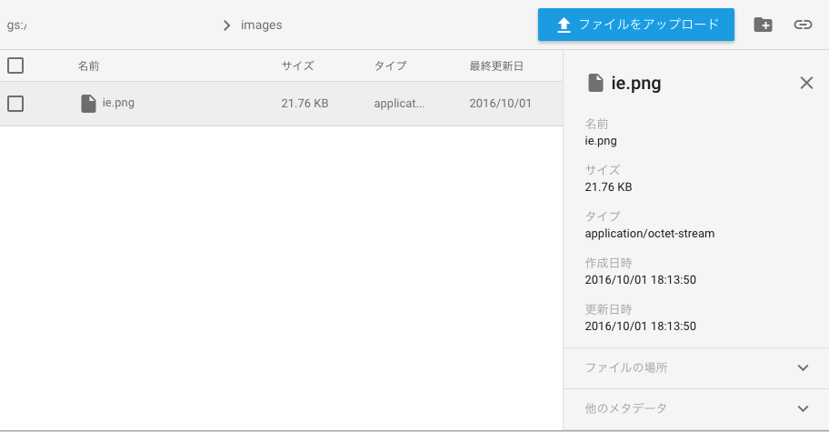
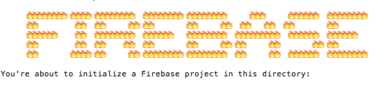
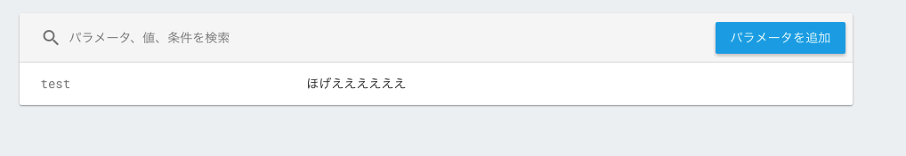
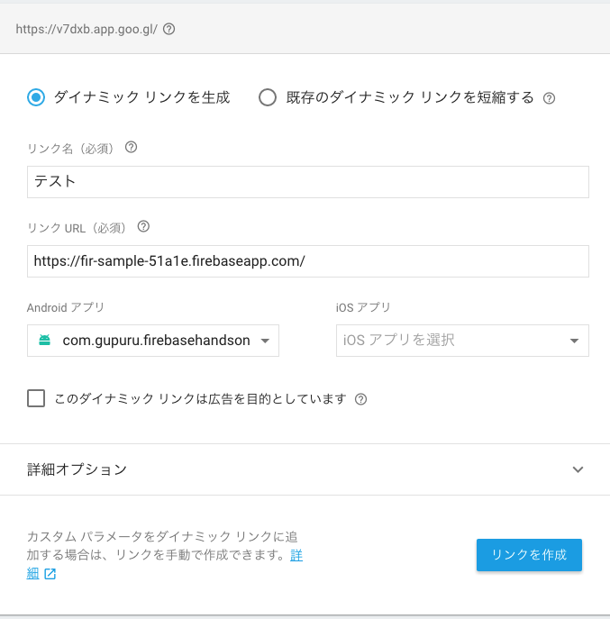

---

# About me

**新見 晃平**

株式会社セフリという会社で、[YAMAP](https://yamap.co.jp/)のAndroidアプリを作っている**iOS**エンジニアです。
最近は、TensorFlow, Docker, Angular2などやっていてiOS全然できてない（泣）

- Twitter: @gupuru
- GitHub: gupuru

---

# [fit] セフリは、どんな企業かと言うと…社長が犬です！


---

# [fit] Firebaseって、何？

---

# Firebase

- mBaaS
- アプリやWeb開発に必要な機能が数多く提供されている
- Googleが運営しているサービス
- 2011年スタート(2014年後半にGoogleが買収)
- 無料でつかえるものが多い

---



---



---

#  [fit] 時間が許す限り、紹介していくよー

---

# [fit] Analytics

---

#  Analytics

- モバイルアプリに特化した Google アナリティクスみたいなもの
- イベント型分析ツール
- 無料
- iOS, Android

---

## iOSの導入

```
pod 'Firebase/Core'
```

```swift
import UIKit
import Firebase

@UIApplicationMain
class AppDelegate: UIResponder, UIApplicationDelegate {

    var window: UIWindow?

    func application(_ application: UIApplication, didFinishLaunchingWithOptions launchOptions: [UIApplicationLaunchOptionsKey: Any]?) -> Bool {
        //追加
        FIRApp.configure()
        return true
    }

}

```

--- 

## Androidの導入

```gradle
compile 'com.google.firebase:firebase-core:9.6.1'
```

```java
public class MainActivity extends AppCompatActivity {
 
    private final MainActivity self = this;
    private FirebaseAnalytics mFirebaseAnalytics;
 
    @Override
    protected void onCreate(Bundle savedInstanceState) {
        super.onCreate(savedInstanceState);
        setContentView(R.layout.activity_main);
        mFirebaseAnalytics = FirebaseAnalytics.getInstance(this);
    }
     
}

```

---



---

# [fit] Cloud Messaging

---

# Cloud Messaging

- プッシュ通知
- iOS, Android, Web
- 無料
- Notification MessageとData Messageの２種類

---

## Notification Message

```js
{
  "to" : "HHwgIpoDKCIZvvDMExUdFQ3P1...",
  "notification" : {
    "body" : "ぼでい",
    "title" : "たいとる",
    "icon" : "myicon"
  }
}
```

```
curl --header "Authorization: key=...guQidTc7xzs8" \
     --header Content-Type:"application/json" \
     https://fcm.googleapis.com/fcm/send \
     -d "{\"to\": \"...ifS-oaJevN_VwU0Y\",\"priority\":\"high\",\"notification\": {\"title\": \"this is title\", \"body\": \"this is body\"}}"
```

---

## Data Message

```js
{
  "to" : "xUdFQ3P1...",
  "data" : {
    "name" : "fox",
    "body" : "neko",
    "Place" : "horaana"
  },
}
```

```
curl --header "Authorization: key=...guQidTc7xzs8" \
     --header Content-Type:"application/json" \
     https://fcm.googleapis.com/fcm/send \
     -d "{\"to\": \"...aJevN_VwU0Y\",\"priority\":\"high\",\"data\": {\"custom_title\": \"this is custom title\", \"custom_body\": \"this is custom body\", \"icon\": \"ic_stat_ic_notification\"}}"

```

---

## Androidの導入

```gradle
compile 'com.google.firebase:firebase-messaging:9.6.1'
```

--- 

## token取得

```java
FirebaseInstanceId.getInstance().getToken();
```

---

## 通知のハンドリング

```java
public class MyFirebaseMessagingService extends FirebaseMessagingService {

    public void onMessageReceived(RemoteMessage remoteMessage) {

        Log.d(TAG, "From: " + remoteMessage.getFrom());

        if (remoteMessage.getData() != null) {
            //data
        }

        if (remoteMessage.getNotification() != null) {
            //notification
        }

    }
}
```

```xml
<service
    android:name=".MyFirebaseMessagingService">
    <intent-filter>
        <action android:name="com.google.firebase.MESSAGING_EVENT"/>
    </intent-filter>
</service>
````

---

# [fit] Notifications

---

# Notifications

- プッシュ通知
- Webコンソールから使う(コードを書く必要なし)
- 無料
- iOS, Android

---



---

# [fit] Authentication

---

# Authentication

- ログイン周り
- メアド, 匿名アカウント, Google, Facebook, Twitter, GitHubなどに対応
- 無料
- FirebaseUIを使えば、uiなども簡単に実装できる
- iOS, Android, Web

---



---

## Androidの導入(firebase UI)

```gradle
compile 'com.firebaseui:firebase-ui-auth:0.6.0'
```

```java
FirebaseAuth auth = FirebaseAuth.getInstance();
if (auth.getCurrentUser() != null) {
    //ログイン済み
} else {
    startActivityForResult(
            AuthUI.getInstance().createSignInIntentBuilder().build(),
            RC_SIGN_IN);
}
```

```java
protected void onActivityResult(int requestCode, int resultCode, Intent data) {
    super.onActivityResult(requestCode, resultCode, data);
    if (requestCode == RC_SIGN_IN) {
        if (resultCode == RESULT_OK) {
            // ログイン成功
        }
    }
}
```
---

## Webの場合

```html
<!DOCTYPE html>
<html>
  <head>
    <meta charset="utf-8">
    <title>Firebase ui sample</title>
   <!-- firebaseのあれを貼ってここに -->
    <script src="https://www.gstatic.com/firebasejs/ui/live/0.5/firebase-ui-auth.js"></script>
    <link type="text/css" rel="stylesheet" href="https://www.gstatic.com/firebasejs/ui/live/0.5/firebase-ui-auth.css" />
    <script type="text/javascript">
      // FirebaseUI config.
      var uiConfig = {
        'signInSuccessUrl': '成功後のurl',
        'signInOptions': [
          firebase.auth.FacebookAuthProvider.PROVIDER_ID,
          firebase.auth.EmailAuthProvider.PROVIDER_ID
        ],
      };
      var ui = new firebaseui.auth.AuthUI(firebase.auth());
      ui.start('#firebaseui-auth-container', uiConfig);
    </script>
  </head>
  <body>
    <div id="firebaseui-auth-container"></div>
  </body>
</html>

```

---


---

# [fit] Realtime Database

---

# Realtime Database

- NoSQL JSON データベース
- リアルタイム同期(オフライン対応)
- iOS, Android, Web
- 有料(無料枠あり)

---

## iOSの導入

```
pod 'Firebase/Database'
```

```swift
import UIKit
import Firebase

@UIApplicationMain
class AppDelegate: UIResponder, UIApplicationDelegate {

    var window: UIWindow?

    func application(_ application: UIApplication, didFinishLaunchingWithOptions launchOptions: [UIApplicationLaunchOptionsKey: Any]?) -> Bool {
        //追加
        FIRApp.configure()
        return true
    }

}

```

---

```swift
import UIKit
import FirebaseDatabase

class ViewController: UIViewController {

    let rootRef = FIRDatabase.database().reference()

    override func viewDidLoad() {
        super.viewDidLoad()
        
        //読み込み    
        rootRef.observe(.value, with: { snapshot in
            print("\(snapshot.key) -> \(snapshot.value)")
        })
        
        //書き込み
        rootRef.child("food").setValue("りんごさま")

    }

}
```

---



---

# [fit]  Storage

---

#  Storage

- ストレージ(S3に近いかも)
- 画像, 動画, 音声などのダウンロード, アップロード
- iOS, Android, Web
- 有料(無料枠あり)

---

## iOSの導入

```ruby
pod 'Firebase/Storage'
```

```swift
import UIKit
import Firebase

@UIApplicationMain
class AppDelegate: UIResponder, UIApplicationDelegate {

    var window: UIWindow?

    func application(_ application: UIApplication, didFinishLaunchingWithOptions launchOptions: [UIApplicationLaunchOptionsKey: Any]?) -> Bool {
        //追加
        FIRApp.configure()
        return true
    }

}

```

---

## アップロード

```swift
import FirebaseStorage

class ViewController: UIViewController {
    
    let storage = FIRStorage.storage()

    override func viewDidLoad() {
        super.viewDidLoad()
   
        let storageRef = storage.reference(forURL: "gs://fir-handson-ce2a8.appspot.com")

        if let data = UIImagePNGRepresentation(UIImage(named: "ie")!) {
            let riversRef = storageRef.child("images/ie.png")
            riversRef.put(data, metadata: nil, completion: { metaData, error in
                print(metaData)
                print(error)
            })
        }
    }
}
```

---



---

## ダウンロード

```swift

import FirebaseStorage

class ViewController: UIViewController {
    
    let storage = FIRStorage.storage()

    override func viewDidLoad() {
        super.viewDidLoad()

        let storageRef = storage.reference(forURL: "gs://fir-handson-ce2a8.appspot.com")

        let ieRef = storageRef.child("images/hogehoge.png")        
        ieRef.data(withMaxSize: 1 * 1024 * 1024) { (data, error) -> Void in
            if (error != nil) {
                print(error)
            } else {
                let image: UIImage! = UIImage(data: data!)
            }
        }
        
    }
}
```

---


---

# [fit] Hosting

---

#  Hosting

- Webサイト公開
- HTTP/2, SSL
- 有料(無料枠あり)
- 独自ドメイン可能(無料)

---

## 導入

```
npm install -g firebase-tools
```

## 初期化

```
firebase init
```

---



---

## 公開

```
firebase deploy
```

## 確認

```
firebase open
```

---

# [fit] Crash Reporting

---

#  Crash Reporting

- クラッシュレポート
- ベータ
- 無料
- iOS, Android

---

## Androidの導入

```gradle
compile 'com.google.firebase:firebase-crash:9.6.1'
```

---


---

# [fit] Remote Config

---

# Remote Config

- クラウドでモバイルアプリの設定値を管理できるサービス
- iOS, Android
- 無料

---

## Androidの導入

```
compile 'com.google.firebase:firebase-config:9.6.1'
```

---

## デフォルト値の設定

```xml
<?xml version="1.0" encoding="utf-8"?>
<defaultsMap>
    <entry>
        <key>test</key>
        <value>てす</value>
    </entry>
</defaultsMap>
```

---

```java
FirebaseRemoteConfig remoteConfig;

remoteConfig = FirebaseRemoteConfig.getInstansce();
//デベロッパーモード指定
FirebaseRemoteConfigSettings configSettings = new FirebaseRemoteConfigSettings.Builder()
        .setDeveloperModeEnabled(BuildConfig.DEBUG)
        .build();
remoteConfig.setConfigSettings(configSettings);
//デフォルトの値を読み込む
remoteConfig.setDefaults(R.xml.remote_config_defaults);

remoteConfig.fetch(43200)
        .addOnCompleteListener(new OnCompleteListener<Void>() {
            @Override
            public void onComplete(@NonNull Task<Void> task) {
                if (task.isSuccessful()) {
                    //値を反映
                    remoteConfig.activateFetched();
                } else {
                    //fetch失敗
                }
            }
        });

```

---



---

#[fit] App Indexing

---

# App Indexing

- ウェブサイトとアプリを紐付ける
- 無料
- iOS, Android

---

##　ディープリンクの設定(Andoirdの場合)

```xml
<activity android:name=".MainActivity">
    <intent-filter>
        <action android:name="android.intent.action.MAIN" />

        <category android:name="android.intent.category.LAUNCHER" />

        <action android:name="android.intent.action.VIEW" />
        <data android:scheme="https"
            android:host="fir-sample-51a1e.firebaseapp.com" />
        <category android:name="android.intent.category.DEFAULT" />
        <category android:name="android.intent.category.BROWSABLE" />

    </intent-filter>
</activity>
```

---

## テスト

```
 adb shell am start -a android.intent.action.VIEW -d "url" com.example.hoe
```

---

#[fit] Dynamic Links

---

# Dynamic Links

- アプリのインストール促進
- 無料
- iOS, Android

---

## Androidの導入

```gradle
compile 'com.google.firebase:firebase-invites:9.6.1'
```

---



---

#[fit] Invites

---

# Invites

- シェア機能
- 無料
- iOS, Android

---

## Androidの導入

```gradle
compile 'com.google.firebase:firebase-invites:9.6.1'
```

※Dynamic Linksの有効が必要

---

## 招待

```java

Intent intent = new AppInviteInvitation.IntentBuilder(getString(R.string.invitation_title))
        .setMessage(getString(R.string.invitation_message))
        .setDeepLink(Uri.parse(getString(R.string.invitation_deep_link)))
        .setCustomImage(Uri.parse(getString(R.string.invitation_custom_image)))
        .setCallToActionText(getString(R.string.invitation_cta))
        .build();
startActivityForResult(intent, REQUEST_INVITE);

```

## 結果

```java
@Override
protected void onActivityResult(int requestCode, int resultCode, Intent data) {
    super.onActivityResult(requestCode, resultCode, data);

    if (requestCode == REQUEST_INVITE) {
        if (resultCode == RESULT_OK) {
            String[] ids = AppInviteInvitation.getInvitationIds(resultCode, data);
            for (String id : ids) {
                Log.d(TAG, "onActivityResult: sent invitation " + id);
            }
        }
    }
}
```

---

## 受信

```java
@Override
protected void onCreate(Bundle savedInstanceState) {

    mGoogleApiClient = new GoogleApiClient.Builder(this)
            .addApi(AppInvite.API)
            .enableAutoManage(this, this)
            .build();

    boolean autoLaunchDeepLink = true;
    AppInvite.AppInviteApi.getInvitation(mGoogleApiClient, this, autoLaunchDeepLink)
            .setResultCallback(
                    new ResultCallback<AppInviteInvitationResult>() {
                        @Override
                        public void onResult(AppInviteInvitationResult result) {
                            if (result.getStatus().isSuccess()) {

                                Intent intent = result.getInvitationIntent();
                                String deepLink = AppInviteReferral.getDeepLink(intent);
                                String invitationId = AppInviteReferral.getInvitationId(intent);

                            }
                        }
                    });
}
```

---

# [fit] まとめ

---

# [fit] Firebase便利だぞ`(･ω･)b`

---

# [fit] 最後に言い忘れたことが...

---

# [fit] 社長の名前は、ハナちゃんです（笑）

---

# [fit] ご清聴、ありがとうございました！